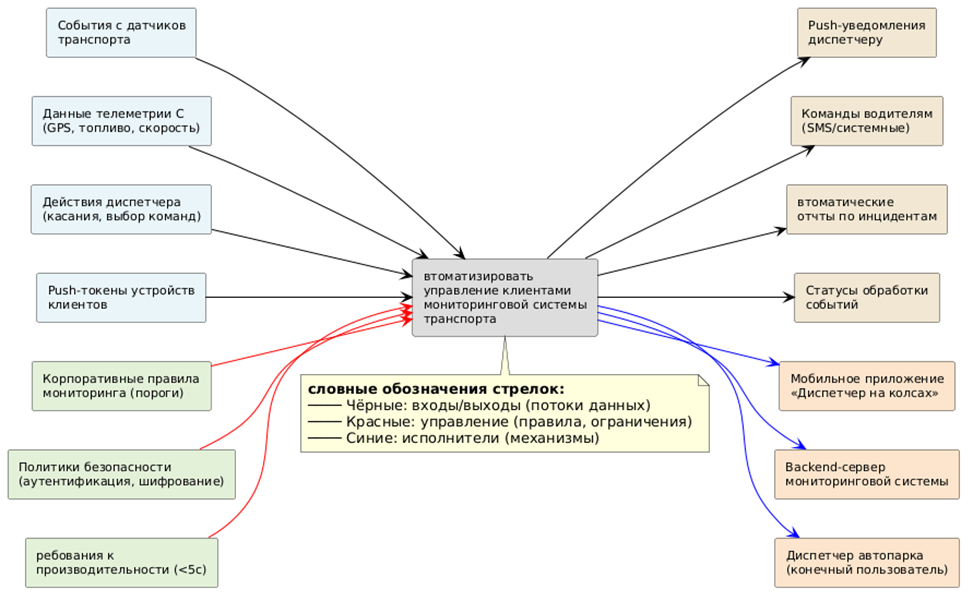
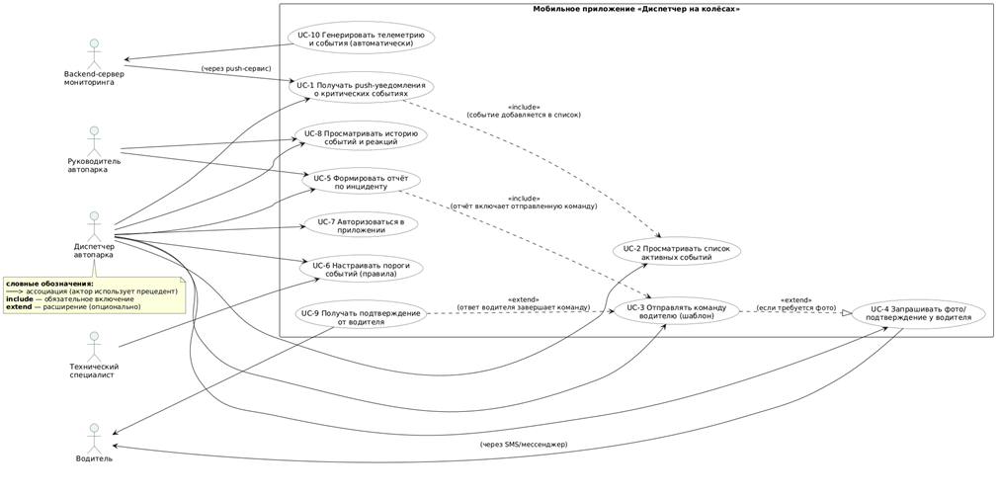

# Паспорт проекта

## 1. ОБЩАЯ ИНФОРМАЦИЯ

| Поле | Значение |
|------|----------|
| **Название проекта** | Диспетчер на колёсах (Dispatch on Wheels) |
| **Траектория** | Mobile (мобильная разработка) |
| **Автор** | Торубаров Максим Евгеньевич |
| **Группа** | ПИЖ-б-о-23-2 |
| **Дата начала** | 15.02.2026 |
| **Плановая дата завершения** | 30.06.2026 |

## 2. БИЗНЕС-КОНТЕКСТ

**Проблема:**  
Диспетчеры автопарков вынуждены постоянно мониторить веб-интерфейс мониторинговой системы для отслеживания аномалий (падение топлива, превышение скорости, простой). Реагирование на инциденты требует ручных звонков водителям или создания заявок в поддержку, что занимает до 30–40 минут в день на одного диспетчера. Критические события часто остаются незамеченными, что приводит к перерасходу топлива и снижению эффективности автопарка.

**Решение:**  
Разработка мобильного приложения «Диспетчер на колёсах», которое автоматически уведомляет диспетчера о критических событиях через push-уведомления в реальном времени. Приложение позволяет в 1–2 касания отправить команду водителю (запросить фото датчика, скорректировать маршрут) или сформировать отчёт по инциденту.

## 3. ЦЕЛИ ПРОЕКТА

- Сократить время реакции диспетчера на критические события с 15 минут до 1 минуты
- Уменьшить количество ручных звонков водителям на 70%
- Снизить нагрузку на техническую поддержку компании за счёт самообслуживания клиента
- Повысить удовлетворённость клиентов оперативностью реагирования на инциденты

## 4. КЛЮЧЕВЫЕ ПОКАЗАТЕЛИ УСПЕХА

- Время от возникновения события до отправки команды водителю < 60 секунд
- Доля инцидентов, обработанных без звонков в поддержку > 80%
- Удовлетворённость диспетчеров интерфейсом приложения > 4.5 из 5
- Количество обработанных событий на одного диспетчера в день > 50

## 5. КЛЮЧЕВЫЕ РИСКИ

| Риск | Вероятность | Стратегия реагирования |
|------|-------------|------------------------|
| Задержка доставки push-уведомлений | Средняя | Автоматический повтор 3 раза, fallback на SMS |
| Нестабильность внешних API (SMS, FCM) | Низкая | Резервные каналы, очередь сообщений |
| Отказ пользователей от внедрения | Средняя | Обучение, демонстрация преимуществ |
| Утечка данных клиентов | Низкая | JWT-токены, шифрование, HTTPS |

---

# IDEF0 A-0 (Контекстная диаграмма)

## Основная функция системы:
**Автоматизировать управление клиентами мониторинговой системы транспорта**

## Входные потоки

- **События с датчиков транспорта** — данные о падении уровня топлива, превышении скорости, длительном простое, входе/выходе из геозон
- **Данные телеметрии ТС** — GPS-координаты, мгновенная скорость, уровень топлива, статус зажигания
- **Действия диспетчера** — касания экрана, выбор шаблона команды водителю, запрос на формирование отчёта
- **Push-токены устройств** — уникальные идентификаторы мобильных устройств клиентов для адресной доставки уведомлений

## Выходные потоки

- **Push-уведомления** — мгновенные оповещения диспетчера о критических событиях с краткой информацией
- **Команды водителям** — автоматически сформированные сообщения (SMS / push) с запросом действия
- **Автоматические отчёты** — документы по инцидентам, содержащие время, место, тип события, реакцию диспетчера
- **Статусы обработки событий** — подтверждение того, что событие получено и обработано

## Управляющие факторы

- **Корпоративные правила мониторинга** — пороговые значения датчиков, при превышении которых событие считается критическим
- **Политики безопасности** — аутентификация диспетчера, шифрование передаваемых данных, разграничение доступа
- **Требования к производительности** — максимальное время доставки уведомления с момента возникновения события не должно превышать 5 секунд

## Исполнители

- **Мобильное приложение «Диспетчер на колёсах»** — клиентская часть для Android, отвечающая за отображение и ввод
- **Backend-сервер мониторинговой системы** — серверная часть, обрабатывающая телеметрию и управляющая push-уведомлениями
- **Диспетчер автопарка** — конечный пользователь, принимающий решения и отправляющий команды

---

# BUC-диаграмма (Бизнес-прецеденты)

## Акторы (бизнес-акторы)

| Актор | Роль | Описание |
|-------|------|----------|
| **Диспетчер автопарка** | Основной пользователь | Получает уведомления, обрабатывает события, отправляет команды водителям |
| **Водитель** | Косвенный участник | Получает команды, отправляет подтверждения и фото |
| **Руководитель автопарка** | Управленческий | Просматривает отчёты и статистику, контролирует эффективность |
| **Технический специалист** | Поддерживающий | Настраивает пороги событий и правила мониторинга |
| **Backend-сервер мониторинга** | Технический | Генерирует события на основе телеметрии |

## Бизнес-прецеденты

| ID | Прецедент | Описание |
|----|-----------|----------|
| UC-1 | Получать push-уведомления о критических событиях | Диспетчер мгновенно узнаёт о падении топлива, превышении скорости |
| UC-2 | Просматривать список активных событий | Диспетчер видит все неподтверждённые инциденты в виде ленты |
| UC-3 | Отправлять команду водителю (шаблон) | Выбор готового шаблона и отправка водителю через SMS/push |
| UC-4 | Запрашивать фото/подтверждение у водителя | Расширенная команда с требованием фотографии датчика |
| UC-5 | Формировать отчёт по инциденту | Автоматическое создание документа с полной цепочкой событий |
| UC-6 | Настраивать пороги событий (правила) | Задание условий, при которых событие считается критическим |
| UC-7 | Авторизоваться в приложении | Вход по логину/паролю или через JWT-токен |
| UC-8 | Просматривать историю событий и реакций | Архив всех инцидентов с фильтрацией |

### Ключевые отношения между прецедентами

- **UC-1 → UC-2 (include)** — Получение уведомления обязательно включает добавление события в список
- **UC-3 → UC-4 (extend)** — Отправка команды может расширяться запросом фото/подтверждения
- **UC-5 → UC-3 (include)** — Формирование отчёта обязательно включает информацию об отправленной команде
- **UC-9 → UC-3 (extend)** — Получение ответа от водителя расширяет процесс отправки команды

---

# SWOT-анализ

## Сильные стороны (внутренние +)

- Готовая мониторинговая система с работающим бэкендом и API
- Существующая клиентская база для тестирования
- Опыт компании в транспортной телематике и понимание предметной области
- Наличие реальных данных с датчиков ТС для отладки
- Кроссплатформенная технология (React Native) — один код для iOS и Android

## Слабые стороны (внутренние -)

- Отсутствие опыта разработки мобильных приложений у команды (гипотетически)
- Высокая нагрузка на существующих диспетчеров в период внедрения
- Устаревшая документация на текущее API
- Риск увеличения времени отклика бэкенда при добавлении нового функционала

## Возможности (внешние +)

- Рост рынка систем мониторинга транспорта (GPS-трекинг, IoT)
- Доступность готовых SDK для push-уведомлений (FCM) и мобильной разработки
- Повышение требований клиентов к скорости реагирования на инциденты
- Возможность вывода продукта на рынок как отдельного решения для автопарков
- Интеграция с популярными мессенджерами (Telegram)

## Угрозы (внешние -)

- Конкуренция с крупными игроками (Wialon, Omnicomm, ГЛОНАСС Софт)
- Утечка данных клиентов при недостаточной защите push-каналов
- Ужесточение законодательства о хранении и обработке геоданных (152-ФЗ, 242-ФЗ)
- Отказ клиентов от внедрения из-за нежелания менять привычные процессы
- Зависимость от стабильности облачных push-сервисов (Google FCM)

## Матрица SWOT (анализ парных связей)

| | **ВОЗМОЖНОСТИ (O)** | **УГРОЗЫ (T)** |
|--|---------------------|-----------------|
| **СИЛЬНЫЕ СТОРОНЫ (S)** | **S-O стратегии:** Использовать готовый бэкенд и базу клиентов для быстрого выхода MVP на рынок | **S-T стратегии:** Применить экспертизу в телематике для создания нишевого решения, недоступного гигантам |
| **СЛАБЫЕ СТОРОНЫ (W)** | **W-O стратегии:** Использовать React Native для кроссплатформенной разработки, снижая порог входа | **W-T стратегии:** Усилить документацию для снижения нагрузки на поддержку |

---

# Расчёт ROI (Окупаемость инвестиций)

## 1. ТЕКУЩИЕ ЗАТРАТЫ (без системы)

- Зарплата диспетчеров: 2 чел × 40 ч/мес × 600 руб/ч = 48,000 руб/мес
- Потери от необработанных инцидентов (перерасход топлива, штрафы): 25,000 руб/мес
- Ручное формирование отчётов: 1 чел × 15 ч/мес × 500 руб/ч = 7,500 руб/мес
- Звонки в техподдержку: 5,000 руб/мес

**Итого:** 85,500 руб/мес × 12 = **1,026,000 руб/год**

## 2. ЗАТРАТЫ ПОСЛЕ ВНЕДРЕНИЯ

- Зарплата диспетчеров: 2 чел × 10 ч/мес × 600 руб/ч = 12,000 руб/мес
- Амортизация системы: 800,000 руб / 3 года / 12 = 22,222 руб/мес
- Поддержка и хостинг push-сервисов: 4,000 руб/мес
- Обучение: 60,000 руб / 12 = 5,000 руб/мес

**Итого:** 43,222 руб/мес × 12 = **518,664 руб/год**

## 3. ПРЯМАЯ ЭКОНОМИЯ

1,026,000 - 518,664 = **507,336 руб/год**

## 4. ДОПОЛНИТЕЛЬНЫЕ ВЫГОДЫ

- Снижение перерасхода топлива: +180,000 руб/год
- Уменьшение штрафов за превышение скорости: +120,000 руб/год
- Повышение лояльности клиентов (снижение оттока на 10%): +150,000 руб/год

**Итого дополнительно:** **450,000 руб/год**

## 5. ОБЩАЯ ВЫГОДА

507,336 + 450,000 = **957,336 руб/год**

## 6. ИНВЕСТИЦИИ

- Разработка мобильного приложения: 600,000 руб
- Интеграция с бэкендом и push-сервисами: 150,000 руб
- Тестирование и отладка: 50,000 руб
- Обучение и документация: 100,000 руб

**Итого:** **900,000 руб**

## 7. ROI (ОКУПАЕМОСТЬ)

**Простой срок окупаемости:** 900,000 / (957,336 / 12) = 900,000 / 79,778 = **11.3 месяца**

**ROI за 3 года:** ((957,336 × 3 - 900,000) / 900,000) × 100% = ((2,872,008 - 900,000) / 900,000) × 100% = **219%**

## Сводная таблица

| Показатель | Значение |
|------------|----------|
| Текущие затраты в год | 1,026,000 руб |
| Затраты после внедрения в год | 518,664 руб |
| Прямая экономия в год | 507,336 руб |
| Дополнительные выгоды в год | 450,000 руб |
| Общая выгода в год | 957,336 руб |
| Инвестиции | 900,000 руб |
| **Срок окупаемости** | **11.3 месяца** |
| **ROI за 3 года** | **219%** |

---

