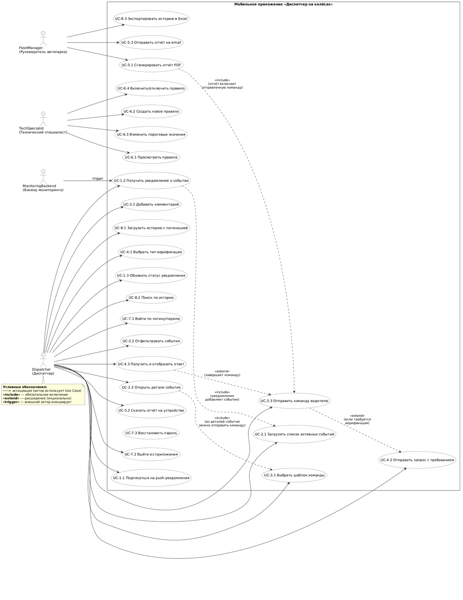
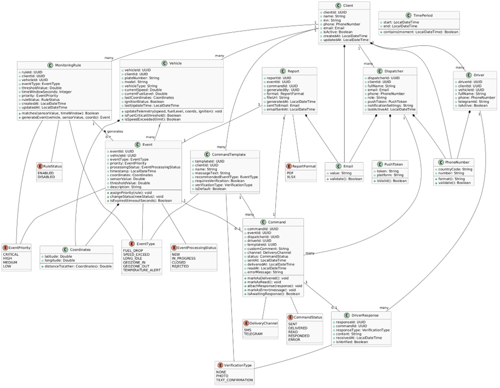

# Use Case диаграмма, Domain Model и трассировка

---

## 1. Use Case диаграмма



### 1.1. Системные акторы

| Актор | Описание | Роль в системе |
|-------|----------|----------------|
| **Диспетчер (Dispatcher)** | Основной пользователь | Получает push-уведомления о событиях, просматривает список инцидентов, отправляет команды водителям |
| **Руководитель (FleetManager)** | Управленческий пользователь | Просматривает отчёты и историю, контролирует эффективность работы диспетчеров |
| **Технический специалист (TechSpecialist)** | Административный пользователь | Настраивает правила мониторинга и пороги срабатывания событий |
| **Водитель (Driver)** | Конечный пользователь | Получает команды от диспетчера, отправляет подтверждения |
| **Backend-сервер мониторинга (MonitoringBackend)** | Внешняя система | Генерирует события на основе телеметрии с датчиков ТС |

### 1.2. Системные Use Case

| ID | Название | Акторы | Краткое описание |
|----|----------|--------|------------------|
| UC-1.1 | Подписаться на push-уведомления | Dispatcher | Регистрация устройства для получения push |
| UC-1.2 | Получить уведомление о событии | Dispatcher, MonitoringBackend | Получение push при срабатывании правила |
| UC-2.1 | Загрузить список активных событий | Dispatcher | Получение списка всех активных инцидентов |
| UC-2.2 | Отфильтровать события | Dispatcher | Фильтрация по типу, приоритету, статусу |
| UC-3.1 | Выбрать шаблон команды | Dispatcher | Выбор из 5+ предустановленных шаблонов |
| UC-3.2 | Добавить комментарий | Dispatcher | Дополнительный текст к команде (до 200 символов) |
| UC-3.3 | Отправить команду водителю | Dispatcher | Отправка через SMS/push с трекингом статуса |
| UC-4.1 | Выбрать тип верификации | Dispatcher | Выбор: фото или текстовое подтверждение |
| UC-4.2 | Отправить запрос с требованием | Dispatcher | Запрос у водителя подтверждения |
| UC-4.3 | Получить и отобразить ответ | Dispatcher | Получение и отображение ответа водителя |
| UC-5.1 | Сгенерировать отчёт PDF | FleetManager | Генерация PDF-отчёта по инциденту |
| UC-5.2 | Скачать отчёт на устройство | Dispatcher | Сохранение отчёта локально |
| UC-5.3 | Отправить отчёт на email | FleetManager | Автоматическая отправка на email |
| UC-6.1 | Просмотреть правила мониторинга | TechSpecialist | Просмотр текущих правил |
| UC-6.2 | Создать новое правило | TechSpecialist | Создание правила с порогами |
| UC-6.3 | Изменить пороговые значения | TechSpecialist | Редактирование существующих правил |
| UC-7.1 | Войти по логину/паролю | Dispatcher, FleetManager, TechSpecialist, Driver | Аутентификация через JWT |
| UC-7.2 | Выйти из приложения | Все пользователи | Завершение сессии |
| UC-8.1 | Загрузить историю событий | Dispatcher, FleetManager | Просмотр архива инцидентов |
| UC-8.2 | Поиск по истории | Dispatcher, FleetManager | Поиск по дате, ТС, типу события |

### 1.3. Отношения include/extend

| Связь | Тип | Описание |
|-------|-----|----------|
| UC-1.2 → UC-2.1 | include | Получение уведомления автоматически обновляет список событий |
| UC-3.3 → UC-4.2 | extend | Отправка команды может расширяться запросом верификации |
| UC-5.1 → UC-3.3 | include | Отчёт включает информацию об отправленной команде |
| UC-4.3 → UC-3.3 | extend | Получение ответа завершает жизненный цикл команды |
| UC-2.3 → UC-3.1 | include | Из деталей события можно отправить команду |

---

## 2. Domain Model (Модель предметной области)



### 2.1. Сущности

#### Client (Автопарк)
| Атрибут | Тип | Описание |
|---------|-----|----------|
| clientId | UUID | Первичный ключ |
| name | String | Название компании |
| inn | String | ИНН (уникальный) |
| phone | String | Контактный телефон |
| email | String | Email (уникальный) |
| isActive | Boolean | Активен/неактивен |
| createdAt | LocalDateTime | Дата создания |
| updatedAt | LocalDateTime | Дата обновления |

#### Vehicle (Транспортное средство)
| Атрибут | Тип | Описание |
|---------|-----|----------|
| vehicleId | UUID | Первичный ключ |
| clientId | UUID | Внешний ключ → Client |
| plateNumber | String | Госномер (уникальный) |
| model | String | Модель ТС |
| currentSpeed | Double | Текущая скорость |
| currentFuelLevel | Double | Уровень топлива |
| latitude | Double | Широта |
| longitude | Double | Долгота |
| ignitionStatus | Boolean | Статус зажигания |

#### Event (Событие)
| Атрибут | Тип | Описание |
|---------|-----|----------|
| eventId | UUID | Первичный ключ |
| vehicleId | UUID | Внешний ключ → Vehicle |
| eventType | Enum | Тип события (FUEL_DROP, SPEED_EXCEED, LONG_IDLE, GEOZONE_IN/OUT, TEMPERATURE_ALERT) |
| priority | Enum | Приоритет (CRITICAL, HIGH, MEDIUM, LOW) |
| status | Enum | Статус (NEW, IN_PROGRESS, CLOSED, REJECTED) |
| timestamp | LocalDateTime | Время возникновения |
| latitude | Double | Широта |
| longitude | Double | Долгота |
| description | String | Описание |

#### Command (Команда)
| Атрибут | Тип | Описание |
|---------|-----|----------|
| commandId | UUID | Первичный ключ |
| eventId | UUID | Внешний ключ → Event |
| dispatcherId | UUID | Внешний ключ → Dispatcher |
| driverId | UUID | Внешний ключ → Driver |
| message | String | Текст команды |
| channel | Enum | Канал (SMS, PUSH) |
| status | Enum | Статус (SENT, DELIVERED, READ, RESPONDED, ERROR) |
| sentAt | LocalDateTime | Время отправки |
| deliveredAt | LocalDateTime | Время доставки |

#### DriverResponse (Ответ водителя)
| Атрибут | Тип | Описание |
|---------|-----|----------|
| responseId | UUID | Первичный ключ |
| commandId | UUID | Внешний ключ → Command |
| responseType | Enum | Тип (PHOTO, TEXT_CONFIRMATION) |
| content | String | URL фото или текст |
| receivedAt | LocalDateTime | Время получения |
| isVerified | Boolean | Подтверждён ли ответ |

#### Dispatcher (Диспетчер)
| Атрибут | Тип | Описание |
|---------|-----|----------|
| dispatcherId | UUID | Первичный ключ |
| clientId | UUID | Внешний ключ → Client |
| fullName | String | ФИО |
| email | String | Email |
| phone | String | Телефон |
| role | String | Роль (dispatcher, manager) |
| pushToken | String | Токен устройства для push |

#### Driver (Водитель)
| Атрибут | Тип | Описание |
|---------|-----|----------|
| driverId | UUID | Первичный ключ |
| clientId | UUID | Внешний ключ → Client |
| vehicleId | UUID | Внешний ключ → Vehicle |
| fullName | String | ФИО |
| phone | String | Телефон |
| telegramId | String | Telegram ID |
| isActive | Boolean | Активен |

#### MonitoringRule (Правило мониторинга)
| Атрибут | Тип | Описание |
|---------|-----|----------|
| ruleId | UUID | Первичный ключ |
| clientId | UUID | Внешний ключ → Client |
| vehicleId | UUID | Внешний ключ → Vehicle (опционально) |
| eventType | Enum | Тип события |
| thresholdValue | Double | Пороговое значение |
| timeWindowSeconds | Integer | Временное окно |
| priority | Enum | Приоритет |
| ruleStatus | Enum | Статус (ENABLED, DISABLED) |

#### Report (Отчёт)
| Атрибут | Тип | Описание |
|---------|-----|----------|
| reportId | UUID | Первичный ключ |
| eventId | UUID | Внешний ключ → Event |
| commandId | UUID | Внешний ключ → Command |
| format | Enum | Формат (PDF, XLSX) |
| fileUrl | String | Ссылка на файл |
| generatedAt | LocalDateTime | Время генерации |

### 2.2. Объекты-значения (Value Objects)

| Класс | Атрибуты | Методы |
|-------|----------|--------|
| **Coordinates** | latitude, longitude | distanceTo(), isValid() |
| **PhoneNumber** | countryCode, number | format(), validate() |
| **Email** | value | validate() |
| **PushToken** | token, platform | isValid() |

### 2.3. Перечисления (Enums)

| Enum | Значения |
|------|----------|
| EventType | FUEL_DROP, SPEED_EXCEED, LONG_IDLE, GEOZONE_IN, GEOZONE_OUT, TEMPERATURE_ALERT |
| EventPriority | CRITICAL, HIGH, MEDIUM, LOW |
| EventStatus | NEW, IN_PROGRESS, CLOSED, REJECTED |
| CommandStatus | SENT, DELIVERED, READ, RESPONDED, ERROR |
| DeliveryChannel | SMS, PUSH |
| VerificationType | NONE, PHOTO, TEXT_CONFIRMATION |
| ReportFormat | PDF, XLSX |
| RuleStatus | ENABLED, DISABLED |

### 2.4. Связи между сущностями

```
Client (1) ──── (1:*) ──── Vehicle
Client (1) ──── (1:*) ──── Dispatcher
Client (1) ──── (1:*) ──── Driver
Client (1) ──── (1:*) ──── MonitoringRule

Vehicle (1) ──── (1:*) ──── Event
Vehicle (1) ──── (1:0..1) ──── Driver

Event (1) ──── (1:0..1) ──── Command
Event (1) ──── (1:0..1) ──── Report

Command (1) ──── (1:0..1) ──── DriverResponse
Command (1) ──── (1:1) ──── Driver (через driverId)
Command (1) ──── (1:1) ──── Dispatcher (через dispatcherId)
```

### 2.5. Бизнес-правила

1. **Уникальность активного события** — для одного ТС не может быть двух активных событий одного типа одновременно

2. **Таймаут команды** — если команда с требованием верификации не подтверждена в течение 30 минут, диспетчер получает напоминание

3. **Приоритет событий** — при получении нескольких событий одновременно, они сортируются по приоритету (CRITICAL > HIGH > MEDIUM > LOW)

4. **Валидация порогов правил** — пороговые значения должны быть в допустимых диапазонах: скорость от 0 до 200 км/ч, падение топлива от 0 до 100 литров

5. **Привязка водителя к ТС** — один водитель может быть привязан только к одному ТС в один момент времени

6. **Неизменяемость закрытых событий** — после перевода события в статус CLOSED его нельзя изменить

---

## 3. Таблица трассировки требований

### 3.1. Бизнес-требования → Системные требования

| ID | Бизнес-требование | Системные Use Case | Компоненты |
|----|-------------------|---------------------|------------|
| BR-01 | Диспетчер должен получать мгновенные уведомления о критических событиях | UC-1.1, UC-1.2 | PushGateway, NotificationService |
| BR-02 | Диспетчер должен иметь возможность отправлять команды водителям | UC-3.1, UC-3.2, UC-3.3 | CommandService, SmsGateway |
| BR-03 | Руководитель должен видеть отчёты по инцидентам | UC-5.1, UC-5.3 | ReportService, PdfGenerator |
| BR-04 | Система должна поддерживать ролевую модель (клиент, диспетчер, водитель) | UC-7.1 | AuthController, JwtService |
| BR-05 | Водитель должен подтверждать получение команд | UC-4.2, UC-4.3 | DriverResponse, CommandService |
| BR-06 | Клиент должен управлять автопарком | UC-6.2 | VehicleController, ClientController |

### 3.2. Системные требования → Архитектурные компоненты

| ID | Системное требование | Control (C) | Mediator (M) | Entity (E) | Foundation (F) |
|-----|----------------------|-------------|--------------|------------|----------------|
| SR-01 | Аутентификация и авторизация | AuthController | JwtService | User | UserRepository |
| SR-02 | Обработка событий мониторинга | EventController | EventService | Event | EventRepository |
| SR-03 | Отправка команд водителям | CommandController | CommandService | Command | CommandRepository |
| SR-04 | Генерация отчётов | ReportController | ReportService | Report | ReportRepository |
| SR-05 | Управление ТС | VehicleController | VehicleService | Vehicle | VehicleRepository |
| SR-06 | Push-уведомления | — | NotificationService | FcmToken | PushGateway |
| SR-07 | Хранение FCM-токенов | AuthController | — | FcmToken | FcmTokenRepository |

### 3.3. Матрица покрытия Use Case → Domain Model сущности

| Use Case | Client | Vehicle | Event | Command | DriverResponse | Dispatcher | Driver | MonitoringRule | Report |
|----------|--------|---------|-------|---------|----------------|------------|--------|----------------|--------|
| UC-1.2 | | | ✓ | | | ✓ | | | |
| UC-3.3 | | | ✓ | ✓ | | ✓ | ✓ | | |
| UC-4.3 | | | | ✓ | ✓ | | ✓ | | |
| UC-5.1 | | ✓ | ✓ | ✓ | | | | | ✓ |
| UC-6.2 | ✓ | | | | | | | ✓ | |
| UC-7.1 | | | | | | | | | |
| UC-8.1 | | ✓ | ✓ | ✓ | | ✓ | | | |

### 3.4. Трассировка по слоям PCMEF

| Use Case | Presentation (клиент) | Control (сервер) | Mediator (сервер) | Entity (сервер) | Foundation (сервер) |
|----------|----------------------|------------------|-------------------|-----------------|---------------------|
| UC-1.2 | PushService | EventController | EventService, NotificationService | Event | EventRepository, PushGateway |
| UC-3.3 | DispatcherEventsScreen | CommandController | CommandService | Command | CommandRepository, SmsGateway |
| UC-5.1 | ReportScreen | ReportController | ReportService | Report | ReportRepository, PdfGenerator |
| UC-7.1 | LoginScreen | AuthController | JwtService | User | UserRepository |

---
