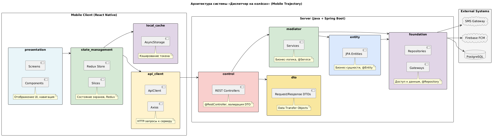

# PCMEF, ADR и интерфейсы

---

## 1. Архитектурный стиль PCMEF

### 1.1. Выбор архитектурного стиля

Для проекта «Диспетчер на колёсах» выбран архитектурный паттерн PCMEF (Presentation-Control-Mediator-Entity-Foundation) в его клиент-серверной адаптации, предназначенной для мобильных приложений.

### 1.2. Обоснование выбора PCMEF

| Причина | Обоснование |
|---------|-------------|
| **Чёткое разделение ответственности** | PCMEF разграничивает UI (Presentation), логику управления (Control), бизнес-правила (Mediator), данные (Entity) и инфраструктуру (Foundation), что критически важно для распределённой архитектуры |
| **Поддержка мобильной траектории** | PCMEF позволяет вынести Presentation на клиент, оставив Control, Mediator, Entity и Foundation на сервере |
| **Тестируемость бизнес-логики** | Mediator-слой изолирован от внешних зависимостей и может тестироваться независимо |
| **Масштабируемость** | Распределённая реализация PCMEF позволяет добавить веб-интерфейс или публичное API без изменения бизнес-логики |
| **Соответствие методическим указаниям** | PCMEF является базовым архитектурным стилем для всех траекторий согласно заданию |

### 1.3. Рассмотренные альтернативы

| Альтернатива | Причина отказа |
|--------------|----------------|
| **MVC** | Не обеспечивает достаточной изоляции бизнес-логики, ведёт к «толстым» контроллерам; слабая поддержка распределённых систем |
| **Clean Architecture** | Более сложная для реализации в рамках учебного проекта; избыточна для масштаба курсовой работы |

### 1.4. Распределение слоёв PCMEF для мобильной траектории

| Слой | Где реализуется | Компоненты | Ответственность |
|------|-----------------|------------|-----------------|
| **Presentation (P)** | React Native | Screens, Components, Navigation | Отображение экранов, ввод данных от пользователя |
| **State Management** | React Native | ViewModels, Redux Slice | Хранение состояния экранов, реакция на действия |
| **API Client** | React Native | ApiClient, Axios | HTTP-запросы к бэкенду |
| **Local Cache** | React Native | AsyncStorage | Кэширование токена и данных для оффлайн-режима |
| **Control (C)** | Spring Boot | REST Controllers | Приём HTTP-запросов, валидация DTO |
| **Mediator (M)** | Spring Boot | Services | Бизнес-логика: правила мониторинга, отправка команд |
| **Entity (E)** | Spring Boot | JPA Entities | Бизнес-сущности |
| **Foundation (F)** | Spring Boot | Repositories, Gateways | Доступ к данным, интеграция с внешними API |

### 1.5. Диаграмма пакетов PCMEF



### 1.6. Направление зависимостей

```
Presentation → State Management → API Client → Control → Mediator → Entity → Foundation → (БД, FCM, SMS)
```

**Правило:** Зависимости направлены строго сверху вниз. Нижние слои не знают о верхних, что обеспечивает слабую связанность.

---

## 2. Архитектурные решения (ADR)

### ADR-001: Выбор архитектурного паттерна

**Статус:** Принято

**Контекст:** Необходимо выбрать архитектурный паттерн для реализации распределённой системы с мобильным клиентом и сервером.

**Решение:** Использовать PCMEF в адаптации для мобильной траектории.

**Последствия:**
- ✅ Чёткое разделение ответственности
- ✅ Возможность тестировать бизнес-логику изолированно
- ✅ Лёгкая замена внешних сервисов (SMS, push)
- ❌ Требуется больше начальных усилий на проектирование

---

### ADR-002: Выбор базы данных и ORM

**Статус:** Принято

**Контекст:** Необходимо выбрать СУБД и инструмент для работы с данными.

**Решение:**
- **СУБД:** PostgreSQL 15+
- **ORM:** Hibernate (Spring Data JPA)

**Последствия:**
- ✅ Поддержка JSON-полей (настройки уведомлений)
- ✅ ACID-транзакции
- ✅ Автоматическая генерация схемы (ddl-auto)
- ❌ Требуется знание JPA/Hibernate

---

### ADR-003: Стратегия аутентификации

**Статус:** Принято

**Контекст:** Необходимо обеспечить безопасный доступ к API для трёх ролей пользователей (Client, Dispatcher, Driver).

**Решение:** Использовать JWT (JSON Web Token) с Spring Security.

**Параметры токена:**
- Время жизни: 24 часа (86400000 мс)
- Алгоритм подписи: HS256
- Секретный ключ: в переменных окружения

**Последствия:**
- ✅ Статeless аутентификация
- ✅ Не требуется хранение сессий
- ✅ Поддержка ролей через claims
- ❌ Нет возможности отозвать токен до истечения

---

### ADR-004: Стратегия отправки уведомлений

**Статус:** Принято

**Контекст:** Диспетчер должен получать мгновенные уведомления о событиях, водитель — о командах.

**Решение:** Использовать Firebase Cloud Messaging (FCM) для push-уведомлений.

**Последствия:**
- ✅ Бесплатно для тестирования и небольшого объёма
- ✅ Мгновенная доставка
- ✅ Поддержка Android и iOS
- ❌ Требуется интернет на устройстве

---

### ADR-005: Выбор мобильного фреймворка

**Статус:** Принято

**Контекст:** Необходимо разработать мобильное приложение для Android (и опционально iOS).

**Решение:** Использовать React Native 0.85+ с TypeScript.

**Последствия:**
- ✅ Одна кодовая база для Android и iOS
- ✅ Большое сообщество и экосистема
- ✅ Интеграция с Redux Toolkit
- ❌ Требуется настройка нативных модулей для push

---

## 3. Интерфейсы между слоями

### 3.1. Интерфейс Control → Mediator (I*Service)

```java
// IEventService.java
public interface IEventService {
    EventDto getEventById(UUID eventId);
    List<EventDto> getActiveEventsByClient(UUID clientId);
    List<EventDto> getEventsByClientId(UUID clientId);
    EventDto updateEventStatus(UUID eventId, EventProcessingStatus newStatus);
    boolean isEventExpired(UUID eventId, int timeoutSeconds);
}

// ICommandService.java
public interface ICommandService {
    CommandDto sendCommand(CommandSendRequest request);
    CommandDto getCommandById(UUID commandId);
    List<CommandDto> getCommandsByEvent(UUID eventId);
    List<CommandDto> getCommandsByDriverId(UUID driverId);
    CommandDto updateCommandStatus(UUID commandId, CommandStatus status);
    CommandDto attachDriverResponse(UUID commandId, DriverResponseRequest response);
}

// IReportService.java
public interface IReportService {
    ReportDto generateReport(UUID eventId, ReportFormat format);
    void sendReportToEmail(UUID reportId, Email email);
    List<ReportDto> getReportsByClient(UUID clientId, LocalDateTime from, LocalDateTime to);
}
```

### 3.2. Интерфейс Mediator → Foundation (I*Repository)

```java
// IEventRepository.java
public interface IEventRepository {
    Event save(Event event);
    Optional<Event> findById(UUID eventId);
    List<Event> findByVehicle_Client_ClientId(UUID clientId);
    List<Event> findByVehicleId(UUID vehicleId);
    List<Event> findActiveByClientId(UUID clientId);
    boolean existsActiveByVehicleAndType(UUID vehicleId, EventType eventType);
}

// ICommandRepository.java
public interface ICommandRepository {
    Command save(Command command);
    Optional<Command> findById(UUID commandId);
    List<Command> findByEventId(UUID eventId);
    List<Command> findByDispatcherId(UUID dispatcherId);
    List<Command> findByDriver_DriverId(UUID driverId);
    List<Command> findPendingResponses(LocalDateTime olderThan);
}

// IDriverRepository.java
public interface IDriverRepository {
    Driver save(Driver driver);
    Optional<Driver> findById(UUID driverId);
    Optional<Driver> findByVehicle_VehicleId(UUID vehicleId);
    List<Driver> findByClient_ClientId(UUID clientId);
}
```

### 3.3. Интерфейс Gateway → Внешние системы

```java
// IPushGateway.java
public interface IPushGateway {
    void sendNotification(PushToken token, PushPayload payload);
    boolean isTokenValid(PushToken token);
}

// ISmsGateway.java
public interface ISmsGateway {
    void sendSms(String phone, String message);
    SmsStatus getSmsStatus(String messageId);
}

// IEmailGateway.java
public interface IEmailGateway {
    void sendEmail(Email to, String subject, String body);
    void sendEmailWithAttachment(Email to, String subject, String body, byte[] attachment, String filename);
}
```

### 3.4. Интерфейс API Client (мобильный клиент)

```typescript
// IEventApi.ts
export interface IEventApi {
  getActiveEvents(): Promise<EventDto[]>;
  getEventById(eventId: string): Promise<EventDetailDto>;
  updateEventStatus(eventId: string, status: EventStatus): Promise<void>;
}

// ICommandApi.ts
export interface ICommandApi {
  sendCommand(request: CommandSendRequest): Promise<CommandDto>;
  getCommandStatus(commandId: string): Promise<CommandStatus>;
  confirmCommand(commandId: string, response: string): Promise<void>;
}

// IAuthApi.ts
export interface IAuthApi {
  login(email: string, password: string): Promise<AuthResponse>;
  register(data: RegisterRequest): Promise<AuthResponse>;
  logout(): Promise<void>;
}
```

### 3.5. Спецификация ключевых методов

| Метод | Параметры | Возвращаемое значение | Исключения |
|-------|-----------|----------------------|------------|
| `EventService.getEventsByClientId` | `UUID clientId` | `List<Event>` | `ClientNotFoundException` |
| `CommandService.sendCommand` | `UUID eventId, String message, UUID driverId` | `Command` | `EventNotFoundException`, `DriverNotFoundException` |
| `NotificationService.sendPushNotification` | `UUID driverId, String title, String body` | `void` | `PushTokenNotFoundException`, `FirebaseMessagingException` |
| `CommandService.confirmCommand` | `UUID commandId, String responseType, String content` | `Command` | `CommandNotFoundException` |

---

