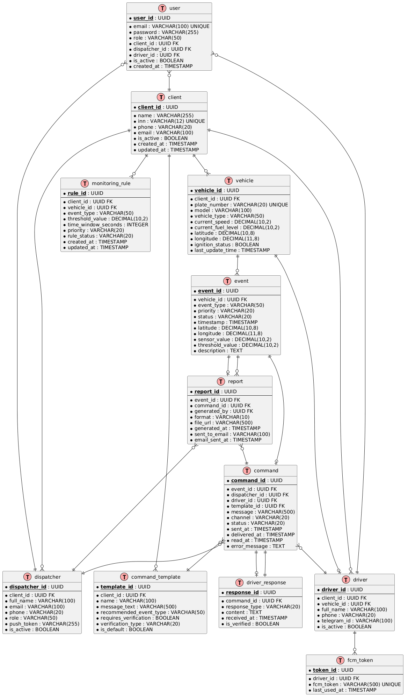

# ER-диаграмма, DDL и ORM

---

## 1. ER-диаграмма (Entity-Relationship Diagram)

### 1.1. Описание сущностей и связей

| Сущность | Описание | Связи |
|----------|----------|-------|
| **client** | Автопарк/клиент системы | 1:N с vehicle, dispatcher, driver, monitoring_rule |
| **vehicle** | Транспортное средство | N:1 с client, 1:N с event, 1:0..1 с driver |
| **event** | Событие (падение топлива, превышение скорости и т.д.) | N:1 с vehicle, 1:0..1 с command, 1:0..1 с report |
| **command** | Команда диспетчера водителю | N:1 с event, N:1 с dispatcher, N:1 с driver |
| **driver_response** | Ответ водителя на команду | 1:1 с command |
| **dispatcher** | Диспетчер | N:1 с client |
| **driver** | Водитель | N:1 с client, 1:0..1 с vehicle |
| **command_template** | Шаблон команды | N:1 с client, 1:N с command |
| **monitoring_rule** | Правило мониторинга | N:1 с client, N:1 с vehicle (опционально) |
| **report** | Отчёт по инциденту | 1:1 с event, 1:1 с command, N:1 с dispatcher |
| **user** | Пользователь для аутентификации | N:1 с client/dispatcher/driver (опционально) |
| **fcm_token** | FCM-токен для push-уведомлений | N:1 с driver |

### 1.2. ER-диаграмма (PlantUML)



---

## 2. DDL-скрипты (PostgreSQL)

### 2.1. Создание таблиц

```sql
-- =====================================================
-- ДИСПЕТЧЕР НА КОЛЁСАХ
-- DDL-скрипт создания базы данных
-- =====================================================

-- Таблица client (Автопарк)
CREATE TABLE client (
    client_id UUID PRIMARY KEY DEFAULT gen_random_uuid(),
    name VARCHAR(255) NOT NULL,
    inn VARCHAR(12) UNIQUE NOT NULL,
    phone VARCHAR(20) NOT NULL,
    email VARCHAR(100) NOT NULL,
    is_active BOOLEAN DEFAULT true,
    created_at TIMESTAMP NOT NULL DEFAULT CURRENT_TIMESTAMP,
    updated_at TIMESTAMP NOT NULL DEFAULT CURRENT_TIMESTAMP
);

-- Таблица vehicle (Транспортное средство)
CREATE TABLE vehicle (
    vehicle_id UUID PRIMARY KEY DEFAULT gen_random_uuid(),
    client_id UUID NOT NULL,
    plate_number VARCHAR(20) UNIQUE NOT NULL,
    model VARCHAR(100),
    vehicle_type VARCHAR(50),
    current_speed DECIMAL(10,2) DEFAULT 0,
    current_fuel_level DECIMAL(10,2),
    latitude DECIMAL(10,8),
    longitude DECIMAL(11,8),
    ignition_status BOOLEAN DEFAULT false,
    last_update_time TIMESTAMP,
    CONSTRAINT fk_vehicle_client FOREIGN KEY (client_id) REFERENCES client(client_id) ON DELETE CASCADE,
    CONSTRAINT chk_vehicle_speed CHECK (current_speed >= 0),
    CONSTRAINT chk_vehicle_fuel CHECK (current_fuel_level BETWEEN 0 AND 1000),
    CONSTRAINT chk_vehicle_latitude CHECK (latitude BETWEEN -90 AND 90),
    CONSTRAINT chk_vehicle_longitude CHECK (longitude BETWEEN -180 AND 180)
);

-- Таблица dispatcher (Диспетчер)
CREATE TABLE dispatcher (
    dispatcher_id UUID PRIMARY KEY DEFAULT gen_random_uuid(),
    client_id UUID NOT NULL,
    full_name VARCHAR(100) NOT NULL,
    email VARCHAR(100) UNIQUE NOT NULL,
    phone VARCHAR(20) NOT NULL,
    role VARCHAR(50) DEFAULT 'dispatcher',
    push_token VARCHAR(255),
    is_active BOOLEAN DEFAULT true,
    CONSTRAINT fk_dispatcher_client FOREIGN KEY (client_id) REFERENCES client(client_id) ON DELETE CASCADE
);

-- Таблица driver (Водитель)
CREATE TABLE driver (
    driver_id UUID PRIMARY KEY DEFAULT gen_random_uuid(),
    client_id UUID NOT NULL,
    vehicle_id UUID UNIQUE,
    full_name VARCHAR(100) NOT NULL,
    phone VARCHAR(20) NOT NULL,
    telegram_id VARCHAR(100),
    is_active BOOLEAN DEFAULT true,
    CONSTRAINT fk_driver_client FOREIGN KEY (client_id) REFERENCES client(client_id) ON DELETE CASCADE,
    CONSTRAINT fk_driver_vehicle FOREIGN KEY (vehicle_id) REFERENCES vehicle(vehicle_id) ON DELETE SET NULL
);

-- Таблица command_template (Шаблон команды)
CREATE TABLE command_template (
    template_id UUID PRIMARY KEY DEFAULT gen_random_uuid(),
    client_id UUID,
    name VARCHAR(100) NOT NULL,
    message_text VARCHAR(500) NOT NULL,
    recommended_event_type VARCHAR(50),
    requires_verification BOOLEAN DEFAULT false,
    verification_type VARCHAR(20),
    is_default BOOLEAN DEFAULT false,
    CONSTRAINT fk_template_client FOREIGN KEY (client_id) REFERENCES client(client_id) ON DELETE CASCADE,
    CONSTRAINT uq_template_client_name UNIQUE (client_id, name)
);

-- Таблица event (Событие)
CREATE TABLE event (
    event_id UUID PRIMARY KEY DEFAULT gen_random_uuid(),
    vehicle_id UUID NOT NULL,
    event_type VARCHAR(50) NOT NULL,
    priority VARCHAR(20) NOT NULL,
    status VARCHAR(20) NOT NULL DEFAULT 'NEW',
    timestamp TIMESTAMP NOT NULL,
    latitude DECIMAL(10,8) NOT NULL,
    longitude DECIMAL(11,8) NOT NULL,
    sensor_value DECIMAL(10,2),
    threshold_value DECIMAL(10,2),
    description TEXT,
    CONSTRAINT fk_event_vehicle FOREIGN KEY (vehicle_id) REFERENCES vehicle(vehicle_id) ON DELETE CASCADE,
    CONSTRAINT chk_event_priority CHECK (priority IN ('CRITICAL', 'HIGH', 'MEDIUM', 'LOW')),
    CONSTRAINT chk_event_status CHECK (status IN ('NEW', 'IN_PROGRESS', 'CLOSED', 'REJECTED')),
    CONSTRAINT chk_event_type CHECK (event_type IN ('FUEL_DROP', 'SPEED_EXCEED', 'LONG_IDLE', 'GEOZONE_IN', 'GEOZONE_OUT', 'TEMPERATURE_ALERT'))
);

-- Таблица command (Команда)
CREATE TABLE command (
    command_id UUID PRIMARY KEY DEFAULT gen_random_uuid(),
    event_id UUID UNIQUE NOT NULL,
    dispatcher_id UUID NOT NULL,
    driver_id UUID NOT NULL,
    template_id UUID,
    message VARCHAR(500) NOT NULL,
    channel VARCHAR(20) NOT NULL,
    status VARCHAR(20) NOT NULL DEFAULT 'SENT',
    sent_at TIMESTAMP NOT NULL,
    delivered_at TIMESTAMP,
    read_at TIMESTAMP,
    error_message TEXT,
    CONSTRAINT fk_command_event FOREIGN KEY (event_id) REFERENCES event(event_id) ON DELETE CASCADE,
    CONSTRAINT fk_command_dispatcher FOREIGN KEY (dispatcher_id) REFERENCES dispatcher(dispatcher_id) ON DELETE RESTRICT,
    CONSTRAINT fk_command_driver FOREIGN KEY (driver_id) REFERENCES driver(driver_id) ON DELETE RESTRICT,
    CONSTRAINT fk_command_template FOREIGN KEY (template_id) REFERENCES command_template(template_id) ON DELETE SET NULL,
    CONSTRAINT chk_command_channel CHECK (channel IN ('SMS', 'PUSH')),
    CONSTRAINT chk_command_status CHECK (status IN ('SENT', 'DELIVERED', 'READ', 'RESPONDED', 'ERROR'))
);

-- Таблица driver_response (Ответ водителя)
CREATE TABLE driver_response (
    response_id UUID PRIMARY KEY DEFAULT gen_random_uuid(),
    command_id UUID UNIQUE NOT NULL,
    response_type VARCHAR(20) NOT NULL,
    content TEXT NOT NULL,
    received_at TIMESTAMP NOT NULL,
    is_verified BOOLEAN DEFAULT false,
    CONSTRAINT fk_driver_response_command FOREIGN KEY (command_id) REFERENCES command(command_id) ON DELETE CASCADE,
    CONSTRAINT chk_response_type CHECK (response_type IN ('PHOTO', 'TEXT_CONFIRMATION'))
);

-- Таблица monitoring_rule (Правило мониторинга)
CREATE TABLE monitoring_rule (
    rule_id UUID PRIMARY KEY DEFAULT gen_random_uuid(),
    client_id UUID NOT NULL,
    vehicle_id UUID,
    event_type VARCHAR(50) NOT NULL,
    threshold_value DECIMAL(10,2) NOT NULL,
    time_window_seconds INTEGER NOT NULL,
    priority VARCHAR(20) NOT NULL,
    rule_status VARCHAR(20) DEFAULT 'ENABLED',
    created_at TIMESTAMP NOT NULL DEFAULT CURRENT_TIMESTAMP,
    updated_at TIMESTAMP NOT NULL DEFAULT CURRENT_TIMESTAMP,
    CONSTRAINT fk_rule_client FOREIGN KEY (client_id) REFERENCES client(client_id) ON DELETE CASCADE,
    CONSTRAINT fk_rule_vehicle FOREIGN KEY (vehicle_id) REFERENCES vehicle(vehicle_id) ON DELETE SET NULL,
    CONSTRAINT chk_rule_priority CHECK (priority IN ('CRITICAL', 'HIGH', 'MEDIUM', 'LOW')),
    CONSTRAINT chk_rule_status CHECK (rule_status IN ('ENABLED', 'DISABLED')),
    CONSTRAINT chk_rule_threshold CHECK (threshold_value > 0),
    CONSTRAINT chk_rule_time_window CHECK (time_window_seconds BETWEEN 1 AND 3600)
);

-- Таблица report (Отчёт)
CREATE TABLE report (
    report_id UUID PRIMARY KEY DEFAULT gen_random_uuid(),
    event_id UUID UNIQUE NOT NULL,
    command_id UUID UNIQUE NOT NULL,
    generated_by UUID NOT NULL,
    format VARCHAR(10) NOT NULL,
    file_url VARCHAR(500) NOT NULL,
    generated_at TIMESTAMP NOT NULL DEFAULT CURRENT_TIMESTAMP,
    sent_to_email VARCHAR(100),
    email_sent_at TIMESTAMP,
    CONSTRAINT fk_report_event FOREIGN KEY (event_id) REFERENCES event(event_id) ON DELETE CASCADE,
    CONSTRAINT fk_report_command FOREIGN KEY (command_id) REFERENCES command(command_id) ON DELETE CASCADE,
    CONSTRAINT fk_report_dispatcher FOREIGN KEY (generated_by) REFERENCES dispatcher(dispatcher_id) ON DELETE SET NULL,
    CONSTRAINT chk_report_format CHECK (format IN ('PDF', 'XLSX'))
);

-- Таблица user (Пользователь для аутентификации)
CREATE TABLE "user" (
    user_id UUID PRIMARY KEY DEFAULT gen_random_uuid(),
    email VARCHAR(100) UNIQUE NOT NULL,
    password VARCHAR(255) NOT NULL,
    role VARCHAR(50) NOT NULL,
    client_id UUID,
    dispatcher_id UUID,
    driver_id UUID,
    is_active BOOLEAN DEFAULT true,
    created_at TIMESTAMP NOT NULL DEFAULT CURRENT_TIMESTAMP,
    CONSTRAINT fk_user_client FOREIGN KEY (client_id) REFERENCES client(client_id) ON DELETE SET NULL,
    CONSTRAINT fk_user_dispatcher FOREIGN KEY (dispatcher_id) REFERENCES dispatcher(dispatcher_id) ON DELETE SET NULL,
    CONSTRAINT fk_user_driver FOREIGN KEY (driver_id) REFERENCES driver(driver_id) ON DELETE SET NULL,
    CONSTRAINT chk_user_role CHECK (role IN ('ROLE_CLIENT', 'ROLE_DISPATCHER', 'ROLE_DRIVER'))
);

-- Таблица fcm_token (FCM-токены для push-уведомлений)
CREATE TABLE fcm_token (
    token_id UUID PRIMARY KEY DEFAULT gen_random_uuid(),
    driver_id UUID NOT NULL,
    fcm_token VARCHAR(500) UNIQUE NOT NULL,
    last_used_at TIMESTAMP DEFAULT CURRENT_TIMESTAMP,
    CONSTRAINT fk_fcm_token_driver FOREIGN KEY (driver_id) REFERENCES driver(driver_id) ON DELETE CASCADE
);

-- =====================================================
-- ИНДЕКСЫ ДЛЯ ОПТИМИЗАЦИИ
-- =====================================================

-- Индексы для vehicle
CREATE INDEX idx_vehicle_client_id ON vehicle(client_id);
CREATE INDEX idx_vehicle_plate_number ON vehicle(plate_number);
CREATE INDEX idx_vehicle_last_update ON vehicle(last_update_time);

-- Индексы для event
CREATE INDEX idx_event_vehicle_id ON event(vehicle_id);
CREATE INDEX idx_event_timestamp ON event(timestamp);
CREATE INDEX idx_event_status ON event(status);
CREATE INDEX idx_event_priority ON event(priority);
CREATE INDEX idx_event_vehicle_time ON event(vehicle_id, timestamp);

-- Индексы для command
CREATE INDEX idx_command_event_id ON command(event_id);
CREATE INDEX idx_command_dispatcher_id ON command(dispatcher_id);
CREATE INDEX idx_command_driver_id ON command(driver_id);
CREATE INDEX idx_command_status ON command(status);
CREATE INDEX idx_command_sent_at ON command(sent_at);

-- Индексы для driver_response
CREATE INDEX idx_driver_response_command_id ON driver_response(command_id);
CREATE INDEX idx_driver_response_received_at ON driver_response(received_at);

-- Индексы для dispatcher
CREATE INDEX idx_dispatcher_client_id ON dispatcher(client_id);
CREATE INDEX idx_dispatcher_email ON dispatcher(email);

-- Индексы для driver
CREATE INDEX idx_driver_client_id ON driver(client_id);
CREATE INDEX idx_driver_vehicle_id ON driver(vehicle_id);
CREATE INDEX idx_driver_phone ON driver(phone);

-- Индексы для user
CREATE INDEX idx_user_email ON "user"(email);
CREATE INDEX idx_user_role ON "user"(role);

-- Индексы для fcm_token
CREATE INDEX idx_fcm_token_driver_id ON fcm_token(driver_id);
```

---

## 3. ORM-стратегия (JPA)

### 3.1. Пример сущности Client

```java
package com.dispatcher.backend.entity;

import jakarta.persistence.*;
import lombok.Data;
import lombok.NoArgsConstructor;
import lombok.AllArgsConstructor;
import org.hibernate.annotations.CreationTimestamp;
import org.hibernate.annotations.UpdateTimestamp;

import java.time.LocalDateTime;
import java.util.ArrayList;
import java.util.List;
import java.util.UUID;

@Entity
@Table(name = "client")
@Data
@NoArgsConstructor
@AllArgsConstructor
public class Client {

    @Id
    @GeneratedValue(strategy = GenerationType.UUID)
    @Column(name = "client_id", updatable = false, nullable = false)
    private UUID clientId;

    @Column(name = "name", nullable = false, length = 255)
    private String name;

    @Column(name = "inn", nullable = false, unique = true, length = 12)
    private String inn;

    @Column(name = "phone", nullable = false, length = 20)
    private String phone;

    @Column(name = "email", nullable = false, length = 100)
    private String email;

    @Column(name = "is_active")
    private Boolean isActive = true;

    @CreationTimestamp
    @Column(name = "created_at", nullable = false, updatable = false)
    private LocalDateTime createdAt;

    @UpdateTimestamp
    @Column(name = "updated_at", nullable = false)
    private LocalDateTime updatedAt;

    @OneToMany(mappedBy = "client", cascade = CascadeType.ALL, orphanRemoval = true, fetch = FetchType.LAZY)
    private List<Vehicle> vehicles = new ArrayList<>();

    @OneToMany(mappedBy = "client", cascade = CascadeType.ALL, orphanRemoval = true, fetch = FetchType.LAZY)
    private List<Dispatcher> dispatchers = new ArrayList<>();

    @OneToMany(mappedBy = "client", cascade = CascadeType.ALL, orphanRemoval = true, fetch = FetchType.LAZY)
    private List<Driver> drivers = new ArrayList<>();
}
```

### 3.2. Пример сущности Event

```java
package com.dispatcher.backend.entity;

import jakarta.persistence.*;
import lombok.Data;
import lombok.NoArgsConstructor;
import lombok.AllArgsConstructor;

import java.time.LocalDateTime;
import java.util.UUID;

@Entity
@Table(name = "event")
@Data
@NoArgsConstructor
@AllArgsConstructor
public class Event {

    @Id
    @GeneratedValue(strategy = GenerationType.UUID)
    @Column(name = "event_id", updatable = false, nullable = false)
    private UUID eventId;

    @ManyToOne(fetch = FetchType.LAZY)
    @JoinColumn(name = "vehicle_id", nullable = false)
    private Vehicle vehicle;

    @Enumerated(EnumType.STRING)
    @Column(name = "event_type", nullable = false)
    private EventType eventType;

    @Enumerated(EnumType.STRING)
    @Column(name = "priority", nullable = false)
    private EventPriority priority;

    @Enumerated(EnumType.STRING)
    @Column(name = "status", nullable = false)
    private EventStatus status = EventStatus.NEW;

    @Column(name = "timestamp", nullable = false)
    private LocalDateTime timestamp;

    @Column(name = "latitude", nullable = false)
    private Double latitude;

    @Column(name = "longitude", nullable = false)
    private Double longitude;

    @Column(name = "sensor_value")
    private Double sensorValue;

    @Column(name = "threshold_value")
    private Double thresholdValue;

    @Column(name = "description", columnDefinition = "TEXT")
    private String description;

    @OneToOne(mappedBy = "event", cascade = CascadeType.ALL, fetch = FetchType.LAZY)
    private Command command;

    @OneToOne(mappedBy = "event", cascade = CascadeType.ALL, fetch = FetchType.LAZY)
    private Report report;

    public void changeStatus(EventStatus newStatus) {
        this.status = newStatus;
    }

    public boolean isExpired(int timeoutSeconds) {
        return LocalDateTime.now().isAfter(timestamp.plusSeconds(timeoutSeconds));
    }
}
```

### 3.3. Перечисления (Enums)

```java
// EventType.java
public enum EventType {
    FUEL_DROP,
    SPEED_EXCEED,
    LONG_IDLE,
    GEOZONE_IN,
    GEOZONE_OUT,
    TEMPERATURE_ALERT
}

// EventPriority.java
public enum EventPriority {
    CRITICAL, HIGH, MEDIUM, LOW
}

// EventStatus.java
public enum EventStatus {
    NEW, IN_PROGRESS, CLOSED, REJECTED
}

// CommandStatus.java
public enum CommandStatus {
    SENT, DELIVERED, READ, RESPONDED, ERROR
}

// DeliveryChannel.java
public enum DeliveryChannel {
    SMS, PUSH
}

// ReportFormat.java
public enum ReportFormat {
    PDF, XLSX
}
```

### 3.4. Стратегии связей

| Связь | Тип | Каскадирование | Fetch | Направление |
|-------|-----|----------------|-------|-------------|
| Client → Vehicle | OneToMany | ALL | LAZY | Однонаправленная |
| Client → Dispatcher | OneToMany | ALL | LAZY | Однонаправленная |
| Client → Driver | OneToMany | ALL | LAZY | Однонаправленная |
| Vehicle → Client | ManyToOne | - | LAZY | Двунаправленная |
| Vehicle → Event | OneToMany | ALL | LAZY | Однонаправленная |
| Vehicle → Driver | OneToOne | - | LAZY | Двунаправленная |
| Event → Command | OneToOne | ALL | LAZY | Двунаправленная |
| Command → Driver | ManyToOne | - | LAZY | Однонаправленная |
| Command → Dispatcher | ManyToOne | - | LAZY | Однонаправленная |
| Driver → Client | ManyToOne | - | LAZY | Однонаправленная |

### 3.5. Стратегия наследования

В данной модели наследование не используется. В случае будущего расширения (например, разные типы событий), рекомендуется стратегия `SINGLE_TABLE` как наиболее производительная.

```java
@Inheritance(strategy = InheritanceType.SINGLE_TABLE)
@DiscriminatorColumn(name = "event_category")
public abstract class BaseEvent {
    // общие поля
}

@Entity
@DiscriminatorValue("FUEL")
public class FuelEvent extends BaseEvent {
    // специфичные поля
}
```

---
