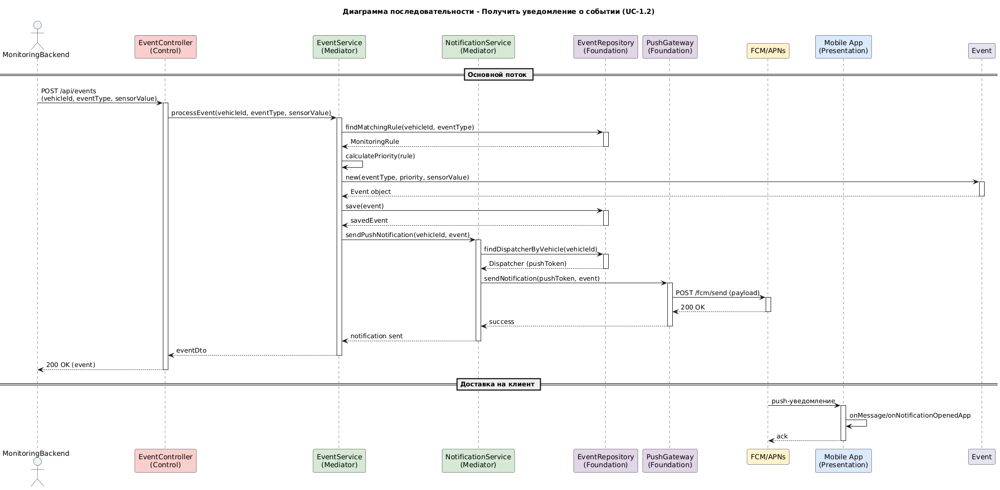
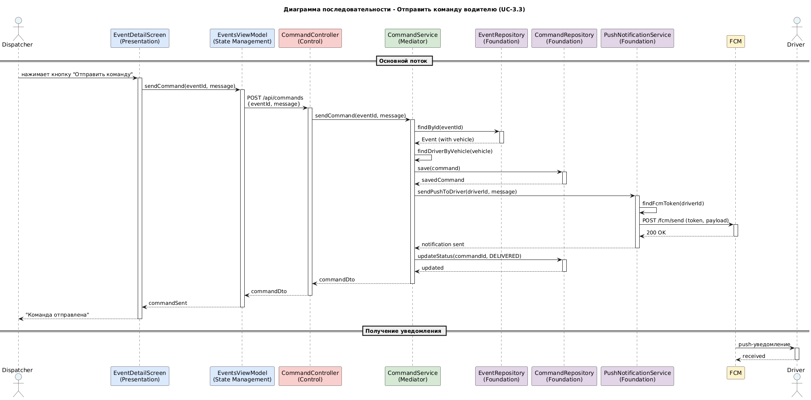
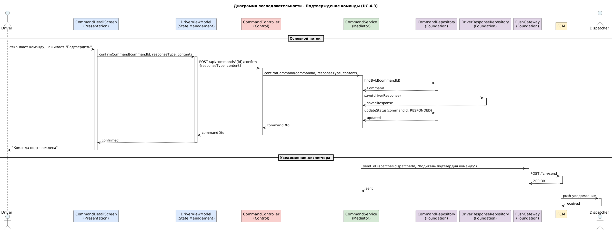
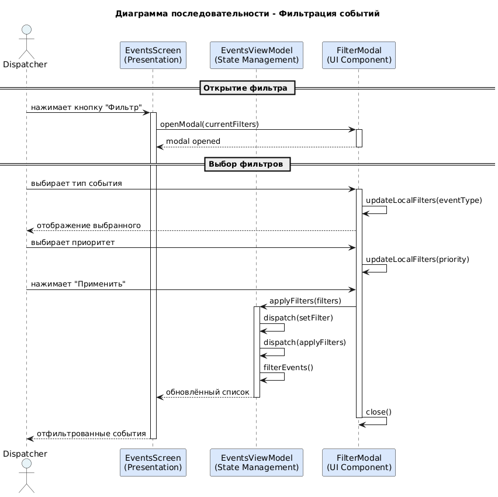

# Sequence диаграммы и спецификация методов

---

## 1. Диаграммы последовательности (Sequence Diagrams)

### 1.1. Сценарий 1: Получение уведомления о событии (UC-1.2)

**Акторы:** MonitoringBackend (внешняя система), Dispatcher (диспетчер)

**Описание:** При возникновении критического события на ТС, бэкенд мониторинга отправляет данные в систему, которая создаёт событие и отправляет push-уведомление диспетчеру.



### 1.2. Сценарий 2: Отправка команды водителю (UC-3.3)

**Акторы:** Dispatcher (диспетчер), Driver (водитель)

**Описание:** Диспетчер, просматривая детали события, выбирает шаблон команды и отправляет её водителю через push-уведомление.



### 1.3. Сценарий 3: Подтверждение команды водителем (UC-4.3)

**Акторы:** Driver (водитель), Dispatcher (диспетчер)

**Описание:** Водитель получает команду, выполняет её и отправляет подтверждение с фото или текстом.



### 1.4. Сценарий 4: Фильтрация событий диспетчером

**Акторы:** Dispatcher (диспетчер)

**Описание:** Диспетчер использует фильтр для отбора событий по типу, приоритету или статусу.



---

## 2. Спецификация ключевых методов

### 2.1. EventService.processEvent

**Краткое описание:** Обрабатывает входящее событие от мониторинговой системы. Проверяет наличие подходящего правила мониторинга, рассчитывает приоритет, создаёт и сохраняет событие, инициирует отправку push-уведомления.

**Сигнатура:**
```java
public Event processEvent(UUID vehicleId, String eventType, double sensorValue, Coordinates coordinates)
```

**Параметры:**
| Параметр | Тип | Описание |
|----------|-----|----------|
| vehicleId | UUID | Идентификатор транспортного средства |
| eventType | String | Тип события (FUEL_DROP, SPEED_EXCEED и т.д.) |
| sensorValue | double | Текущее значение датчика |
| coordinates | Coordinates | GPS-координаты места события |

**Возвращаемое значение:** `Event` — созданный объект события

**Исключения:**
| Исключение | Условие возникновения |
|------------|----------------------|
| RuleNotFoundException | Не найдено активное правило мониторинга для данного ТС и типа события |
| DataAccessException | Ошибка сохранения события в базу данных |
| InvalidParameterException | Некорректные значения параметров (vehicleId = null, eventType не из списка) |

---

### 2.2. CommandService.sendCommand

**Краткое описание:** Отправляет команду водителю. Проверяет существование события и водителя, создаёт команду, отправляет push-уведомление и обновляет статус.

**Сигнатура:**
```java
public Command sendCommand(UUID eventId, String message, UUID driverId)
```

**Параметры:**
| Параметр | Тип | Описание |
|----------|-----|----------|
| eventId | UUID | Идентификатор события |
| message | String | Текст команды (до 500 символов) |
| driverId | UUID | Идентификатор водителя |

**Возвращаемое значение:** `Command` — созданный объект команды со статусом DELIVERED

**Исключения:**
| Исключение | Условие возникновения |
|------------|----------------------|
| EventNotFoundException | Событие с указанным ID не найдено |
| DriverNotFoundException | Водитель с указанным ID не найден |
| PushTokenNotFoundException | У водителя нет зарегистрированного FCM-токена |
| FirebaseMessagingException | Ошибка при отправке push-уведомления |

---

### 2.3. CommandService.confirmCommand

**Краткое описание:** Обрабатывает подтверждение команды от водителя. Сохраняет ответ (текст или фото) и обновляет статус команды.

**Сигнатура:**
```java
public Command confirmCommand(UUID commandId, String responseType, String content)
```

**Параметры:**
| Параметр | Тип | Описание |
|----------|-----|----------|
| commandId | UUID | Идентификатор команды |
| responseType | String | Тип ответа (PHOTO или TEXT_CONFIRMATION) |
| content | String | Текст подтверждения или URL фото |

**Возвращаемое значение:** `Command` — обновлённый объект команды со статусом RESPONDED

**Исключения:**
| Исключение | Условие возникновения |
|------------|----------------------|
| CommandNotFoundException | Команда с указанным ID не найдена |
| InvalidResponseTypeException | Некорректный тип ответа |
| CommandAlreadyConfirmedException | Команда уже была подтверждена ранее |

---

### 2.4. EventService.getEventsByClientId

**Краткое описание:** Возвращает список событий, относящихся к ТС указанного клиента. Используется для фильтрации событий для диспетчера.

**Сигнатура:**
```java
public List<Event> getEventsByClientId(UUID clientId)
```

**Параметры:**
| Параметр | Тип | Описание |
|----------|-----|----------|
| clientId | UUID | Идентификатор клиента (автопарка) |

**Возвращаемое значение:** `List<Event>` — список событий, отсортированный по убыванию времени (сначала новые)

**Исключения:**
| Исключение | Условие возникновения |
|------------|----------------------|
| ClientNotFoundException | Клиент с указанным ID не найден |

---

### 2.5. DriverService.assignVehicleToDriver

**Краткое описание:** Привязывает водителя к транспортному средству. Проверяет, что ТС принадлежит тому же клиенту и не привязано к другому водителю.

**Сигнатура:**
```java
public Driver assignVehicleToDriver(UUID driverId, UUID vehicleId)
```

**Параметры:**
| Параметр | Тип | Описание |
|----------|-----|----------|
| driverId | UUID | Идентификатор водителя |
| vehicleId | UUID | Идентификатор транспортного средства |

**Возвращаемое значение:** `Driver` — обновлённый объект водителя с привязанным ТС

**Исключения:**
| Исключение | Условие возникновения |
|------------|----------------------|
| DriverNotFoundException | Водитель не найден |
| VehicleNotFoundException | ТС не найдено |
| VehicleAlreadyAssignedException | ТС уже привязано к другому водителю |
| ClientMismatchException | ТС не принадлежит клиенту водителя |

---

### 2.6. NotificationService.sendPushNotification

**Краткое описание:** Отправляет push-уведомление водителю или диспетчеру через Firebase Cloud Messaging.

**Сигнатура:**
```java
public void sendPushNotification(UUID userId, String title, String body, Map<String, String> data)
```

**Параметры:**
| Параметр | Тип | Описание |
|----------|-----|----------|
| userId | UUID | Идентификатор пользователя-получателя |
| title | String | Заголовок уведомления |
| body | String | Текст уведомления |
| data | Map<String, String> | Дополнительные данные (eventId, commandId) |

**Возвращаемое значение:** `void`

**Исключения:**
| Исключение | Условие возникновения |
|------------|----------------------|
| UserNotFoundException | Пользователь не найден |
| PushTokenNotFoundException | У пользователя нет FCM-токена |
| FirebaseMessagingException | Ошибка при отправке уведомления |

---

## 3. Сводная таблица методов

| Метод | Класс | Слой | Основная ответственность |
|-------|-------|------|--------------------------|
| `processEvent` | EventService | Mediator | Обработка входящего события |
| `sendCommand` | CommandService | Mediator | Отправка команды водителю |
| `confirmCommand` | CommandService | Mediator | Подтверждение команды |
| `getEventsByClientId` | EventService | Mediator | Фильтрация событий по клиенту |
| `assignVehicleToDriver` | DriverService | Mediator | Привязка водителя к ТС |
| `sendPushNotification` | NotificationService | Mediator | Отправка push-уведомления |
| `getCurrentUser` | AuthController | Control | Получение текущего пользователя |
| `generateReport` | ReportService | Mediator | Генерация PDF/XLSX отчёта |

---

