# Скриншоты интерфейсов

## 1. Экран авторизации

### 1.1. Экран входа (Login Screen)

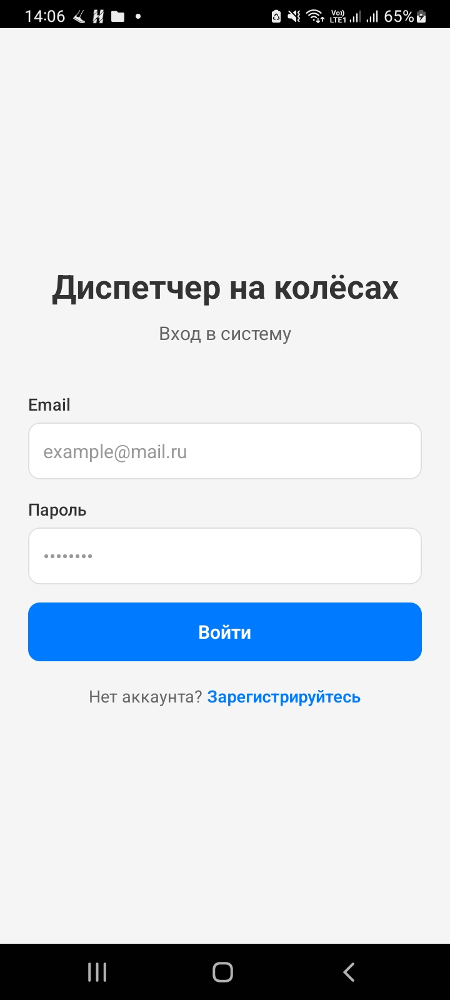

**Описание:** Экран входа содержит поля для ввода email и пароля, кнопку «Войти» и ссылку на регистрацию. При успешном входе пользователь перенаправляется на главный экран в зависимости от роли.

**Элементы экрана:**
- Заголовок «Диспетчер на колёсах»
- Поле ввода Email
- Поле ввода Пароль (скрытый ввод)
- Кнопка «Войти»
- Ссылка «Нет аккаунта? Зарегистрируйтесь»

---

### 1.2. Экран регистрации (Register Screen)

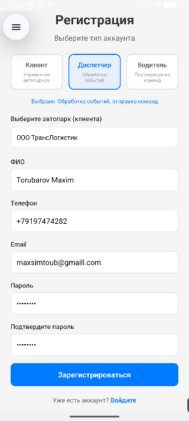

**Описание:** Экран регистрации позволяет создать новый аккаунт с выбором роли: Клиент, Диспетчер или Водитель. В зависимости от выбранной роли, пользователь может выбрать автопарк (для диспетчера и водителя).

**Элементы экрана:**
- Заголовок «Регистрация»
- Выбор роли (3 кнопки с иконками)
- Поле ФИО
- Поле Телефон
- Поле Email
- Поле Пароль
- Поле Подтверждение пароля
- Выбор автопарка (для диспетчера/водителя)
- Кнопка «Зарегистрироваться»

---

## 2. Экран диспетчера

### 2.1. Экран списка событий (Events Screen)

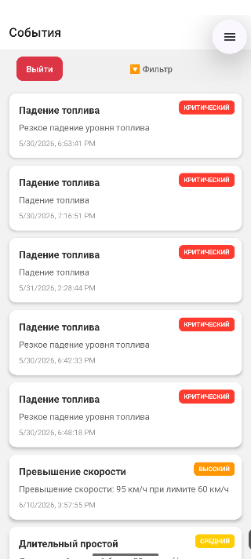

**Описание:** Главный экран диспетчера, отображающий список всех активных событий (инцидентов) с возможностью фильтрации. События отображаются в виде карточек с приоритетом, типом и кратким описанием.

**Элементы экрана:**
- Кнопка фильтрации (с индикатором активных фильтров)
- Кнопка «Сбросить» (при активных фильтрах)
- Кнопка «Выйти» в правом верхнем углу
- Список событий (карточки с приоритетом, типом, описанием, временем)
- Pull-to-refresh для обновления списка

**Цветовая индикация приоритетов:**
- 🔴 Критический (CRITICAL) — красный
- 🟠 Высокий (HIGH) — оранжевый
- 🟡 Средний (MEDIUM) — жёлтый
- 🟢 Низкий (LOW) — зелёный

---

### 2.2. Экран деталей события (Event Detail Screen)

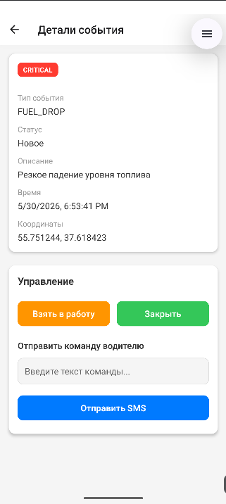

**Описание:** Экран с полной информацией о событии. Диспетчер может изменить статус события, просмотреть подробности и отправить команду водителю.

**Элементы экрана:**
- Бейдж с приоритетом события
- Тип события
- Статус обработки
- Полное описание
- Время возникновения
- GPS-координаты
- Кнопка «Взять в работу» (смена статуса на IN_PROGRESS)
- Кнопка «Закрыть» (смена статуса на CLOSED)
- Поле ввода текста команды
- Кнопка «Отправить команду»

---

### 2.3. Экран фильтрации событий (Filter Modal)

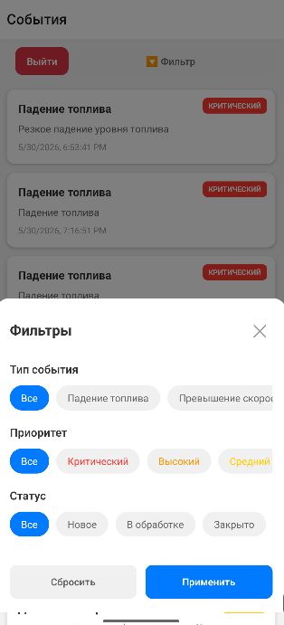

**Описание:** Модальное окно для фильтрации списка событий по типу, приоритету и статусу.

**Элементы экрана:**
- Заголовок «Фильтры»
- Секция «Тип события» (падение топлива, превышение скорости, длительный простой, въезд/выезд из геозоны, температурная тревога)
- Секция «Приоритет» (критический, высокий, средний, низкий)
- Секция «Статус» (новое, в обработке, закрыто)
- Кнопка «Сбросить»
- Кнопка «Применить»

---

## 3. Экран водителя

### 3.1. Экран списка команд (Driver Commands Screen)

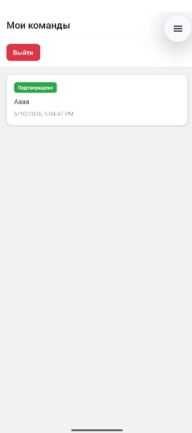

**Описание:** Экран водителя, отображающий список всех полученных команд от диспетчера с указанием статуса выполнения.

**Элементы экрана:**
- Заголовок «Мои команды»
- Кнопка «Выйти»
- Список команд (карточки с текстом команды, статусом и временем)
- Pull-to-refresh для обновления списка

**Цветовая индикация статусов:**
- 🟠 Отправлено (SENT) — оранжевый
- 🔵 Доставлено (DELIVERED) — синий
- 🟢 Прочитано (READ) — зелёный
- ✅ Подтверждено (RESPONDED) — тёмно-зелёный
- 🔴 Ошибка (ERROR) — красный

---

### 3.2. Экран деталей команды (Command Detail Screen)

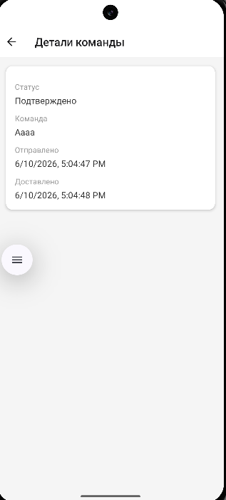

**Описание:** Экран с полной информацией о команде. Водитель может подтвердить выполнение команды с текстовым комментарием.

**Элементы экрана:**
- Статус команды
- Полный текст команды
- Время отправки
- Время доставки (если есть)
- (При наличии ошибки) Текст ошибки
- Поле ввода текста подтверждения
- Кнопка «Подтвердить выполнение»

---

## 4. Экран клиента

### 4.1. Панель управления клиента (Client Dashboard Screen)

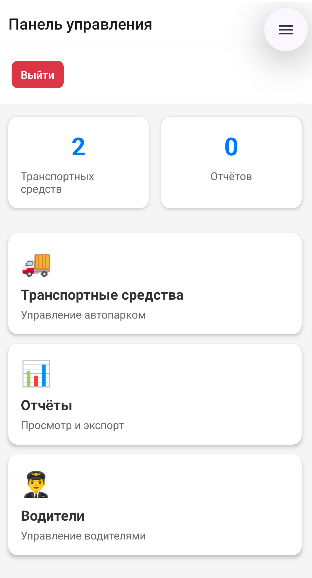

**Описание:** Главный экран клиента со статистикой и навигацией по разделам.

**Элементы экрана:**
- Заголовок «Панель управления»
- Кнопка «Выйти»
- Статистика: количество транспортных средств и отчётов
- Карточка «Транспортные средства» (иконка 🚚)
- Карточка «Водители» (иконка 👨‍✈️)
- Карточка «Отчёты» (иконка 📊)
- Pull-to-refresh для обновления данных

---

### 4.2. Экран управления транспортными средствами (Client Vehicles Screen)
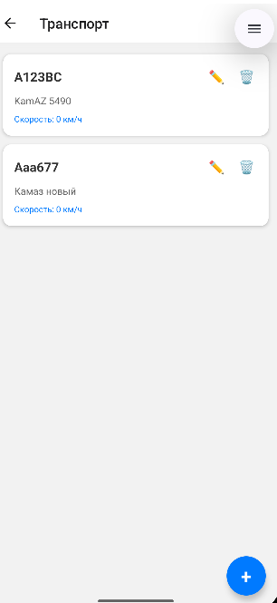

**Описание:** Экран для управления автопарком: просмотр, добавление, редактирование и удаление транспортных средств.

**Элементы экрана:**
- Список транспортных средств (карточки с госномером, моделью, типом)
- Кнопка «+» для добавления нового ТС
- У каждого ТС: кнопка редактирования ✏️ и удаления 🗑️
- Pull-to-refresh для обновления списка

---

### 4.3. Экран управления водителями (Client Drivers Screen)

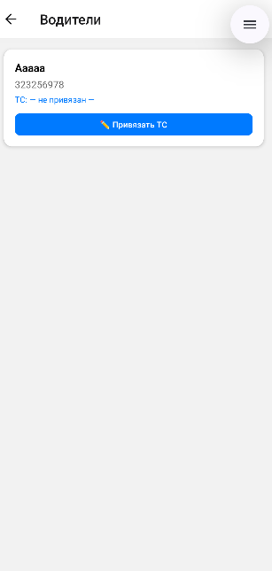

**Описание:** Экран для управления водителями: просмотр списка, привязка к транспортным средствам и отвязка.

**Элементы экрана:**
- Список водителей (карточки с ФИО, телефоном, привязанным ТС)
- Кнопка «Привязать ТС» у каждого водителя
- Кнопка «Отвязать» (если ТС привязано)
- Pull-to-refresh для обновления списка

---

### 4.4. Модальное окно привязки водителя к ТС

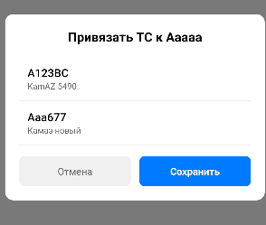

**Описание:** Окно для выбора транспортного средства, к которому нужно привязать водителя.

**Элементы экрана:**
- Заголовок «Привязать ТС к [ФИО водителя]»
- Список доступных ТС (госномер + модель)
- Кнопка «Отмена»
- Кнопка «Сохранить»
